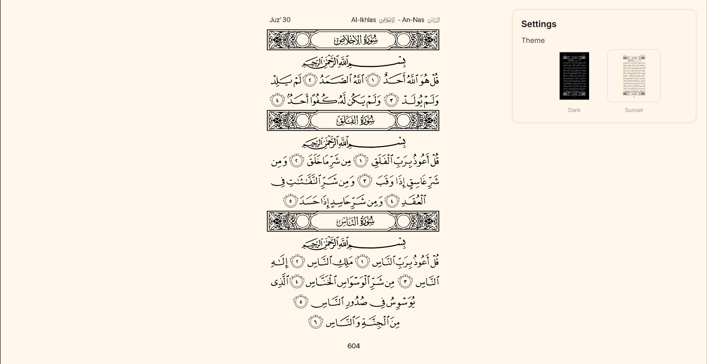
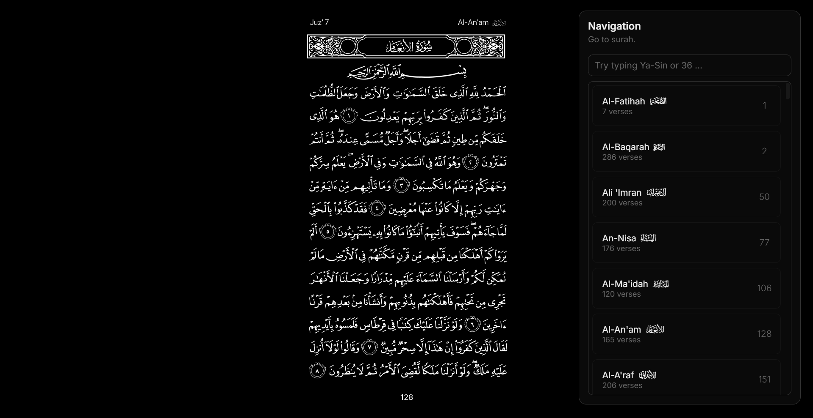

# Al-Qur'an — القرآن

## Overview
- A lightweight, keyboard-friendly, open-sourced Quran viewer with fast preloading, page navigation.  
- Read the Quran easily while recording your progress. Great for completing the Quran during Ramadan.
- The future is here, no need for a physical book when you can read the Quran in your browser.

## Page Preview

  
  &nbsp;&nbsp;&nbsp;&nbsp;&nbsp;&nbsp;&nbsp;&nbsp;&nbsp;&nbsp;&nbsp;
  

## Controls
- `/` opens Page menu
- `o` toggles Settings menu
- `n` toggles Navigation Menu
- `b` toggles Bookmarks Menu
- `<` `>` arrow keys navigate pages

   
  Press <b>o</b> on keyboard to toggle Settings menu

 

   
  Press <b>n</b> on keyboard to toggle Navigation menu

## Get Started
- Open `quran` in your browser or head to [the site](https://1uc1d23.github.io/quran).

## Features
- Fast image preloading with safe swapping to avoid blank frames on rapid navigation.  
- Bottom-right page Navigate panel and top-right Settings panel with theme switching.  
- Two built-in themes (Dark and Sunset) implemented via CSS variables for instant customization.  
